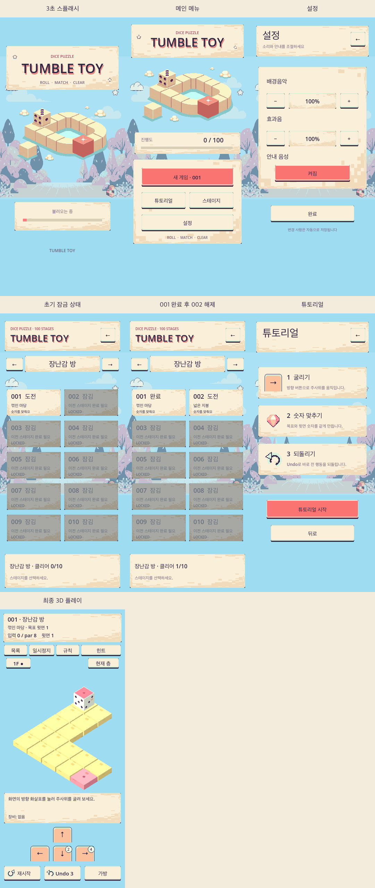
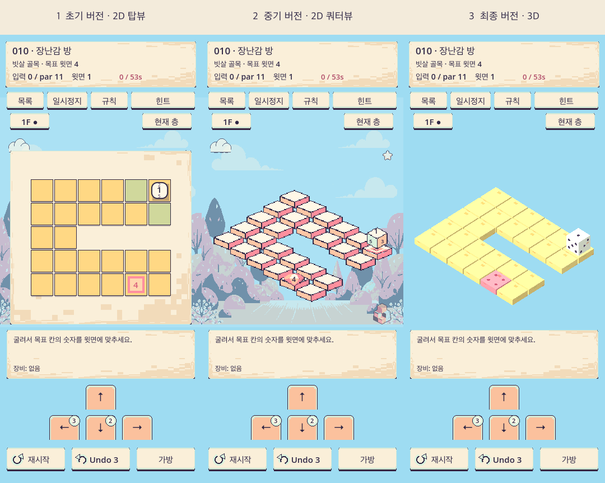

# Tumble Toy

주사위를 굴려 목표 타일에 도착했을 때 윗면 숫자를 맞추는 퍼즐 게임입니다. 기획 문서부터 코드, 이미지, 효과음, 배경음, 음성까지 AI 에이전트와 생성형 AI로 만들었고, 개발 내내 **스펙 드리븐 개발** 방식으로 진행했습니다.



## 게임 소개

- 격자형 장난감 블록 위에서 표준 6면체 주사위를 굴립니다. 목표 타일에 도착했을 때 윗면 숫자가 요구 숫자와 같으면 클리어입니다.
- 10개 테마, 100개 스테이지로 구성되어 있습니다.
- 얼음, 불, 전기, 포털, 스위치, 내구도 블록, 여러 층 같은 특수 타일과 아이템이 있습니다.
- 언두, 재시작, 목표 이동 수(par)와 완벽 클리어, 시간 메달을 지원합니다.
- 스플래시, 메인 메뉴, 튜토리얼, 스테이지 선택(진행 잠금), 설정(BGM, 효과음, 안내 음성) 화면이 있습니다.
- 기준 화면은 360×800 세로입니다.

## 탑뷰에서 3D까지

같은 캠페인 데이터와 규칙 엔진 위에 세 가지 개발 버전을 보존했습니다. 실제 게임은 최종 3D로 실행됩니다.

1. **초기:** 규칙 검증용 2D 탑뷰
2. **중기:** 생성 이미지 리소스를 적용한 2D 쿼터뷰
3. **최종:** Godot 메시, 카메라, 조명에 저해상도 픽셀 텍스처를 입힌 3D



## 사용한 AI 도구

| 영역 | 도구 |
| --- | --- |
| 개발 | AI 코딩 에이전트 + Godot 4.7.2 |
| 픽셀 이미지, 3D 텍스처 | PixelLab (MCP) |
| 효과음 | Stable Audio 3 |
| 배경음 | MiniMax Music 3 |
| 음성 | Chatterbox |

실제로 사용한 프롬프트와 시드는 `docs/*-prompts.json`에 기록되어 있습니다.

## 스펙 드리븐 개발

에이전트에게 처음 준 지시는 세 줄이었습니다.

1. 스펙 드리븐 개발 방법론으로 진행할 것이다
2. 무조건 스펙 문서를 작성, 업데이트한다
3. 이후 스펙 문서를 바탕으로 개발을 진행한다

그래서 모든 변경은 스펙 문서에서 시작해 코드로 이어지고, 검증 결과와 함께 기록됩니다.

| 문서 | 내용 |
| --- | --- |
| [`docs/product-spec.md`](docs/product-spec.md) | 제품 개요, 화면 흐름, 입력, 시각 방향, 범위 |
| [`docs/gameplay-spec.md`](docs/gameplay-spec.md) | 주사위 회전, 클리어 판정, 타일 규칙 |
| [`docs/campaign-spec.md`](docs/campaign-spec.md) | 100스테이지 캠페인과 확장 기능, 완료 조건 |
| [`docs/level-spec.md`](docs/level-spec.md) | 레벨 데이터 형식과 생성 규칙 |
| [`docs/asset-spec.md`](docs/asset-spec.md) | 이미지, 오디오 에셋 목록과 생성 기록 |
| [`docs/implementation-plan.md`](docs/implementation-plan.md) | 날짜별 구현 기록과 검증 결과 |
| [`AGENTS.md`](AGENTS.md) | 에이전트 작업 규칙 (변경 후 시뮬레이터 재실행) |

## 실행

[Godot 4.7.2](https://godotengine.org/)로 프로젝트 폴더를 열고 실행합니다. 명령행에서는 다음과 같이 실행할 수 있습니다.

```bash
godot --path .
```

개발 확인용으로 시작 스테이지와 보기 방식을 지정할 수 있습니다.

```bash
godot --path . -- --stage=10 --view=top   # top, quarter, 3d
```

PC 조작은 방향키 또는 WASD로 이동, Z로 언두, R로 재시작입니다.

## 검증

100개 스테이지는 모두 해법이 검증되어 있고, 해법 입력 1,537개를 실제로 재생해 전 스테이지 클리어를 확인합니다.

```bash
godot --headless --path . res://tests/rules_test.tscn        # 규칙 검사
godot --headless --path . -s res://tests/campaign_play_test.gd  # 100스테이지 재생 검사
```

## 폴더 구조

```
docs/        스펙 문서, 구현 기록, 생성 프롬프트
data/        캠페인 레벨 데이터
assets/      이미지, 3D 텍스처, 효과음, 배경음, 음성
tests/       규칙 테스트, 캠페인 재생 테스트
tools/       캠페인 빌드, 화면 캡처, 에셋 생성, 감사 스크립트
artifacts/   게임 화면 캡처와 에셋 비교 이미지
```

---

만든 사람: 양희문, [(주)시스루](https://theethru.com)
